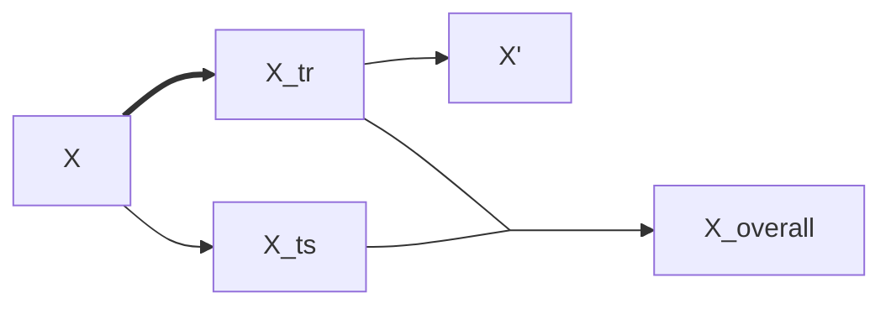

concepts
1. hyperparamters: 
2. train-test splitting
	1. splitting the dataset into a training set and a test set to verify the model
3. ML algo
	1. deep neural networks
		1. need a lot of samples
	2. random forest
		1. struggles with way more features than samples (do a PCA to limit features)
	3. k-nearest neighbour
		1. curse of dimensionality (squashes huge difference in small number of features)
	4. support vector machine
	5. logistic regression

order of operations
1. data cleaning
	1. PCA 
2. train-test splitting
	1. k-fold; under represented classes 
	2. strattified splitting !!!
 hyperparameters 
	 how to search?
		grid search
	narrow or broad range?
		
3. data scaling
	$$ x_{ij}'=\frac{x-min(x_j)}{max(x_j)-min(x_j)}$$
4. validation
	1. how to quantify performance of ML
		accuracy
			percentage of  correct predictions (can only be used when classes are perfectly balanced)
			$$accuracy = \frac{\Sigma_i (\hat{y}=y)}{n}*100$$
		precision
		MSE
		loss
1. training on the full set
2. application to new data

classification metrics
1. accuracy
2. recall(sensitivity)
3. balanced accuracy (always use this)
	$$BA=(\frac{TP}{nP}+\frac{TN}{nN})\times 0.5 $$
4. R2
sensitivity = TP/nP
specificity
how to choose a model?
	size and quality of data
	interpretability requirements
	amount of computational resources

how to balance bias and variance
1. regularisation
	1. lasso
	2. ridge
	3. dropout
how to choose classification metrics?
